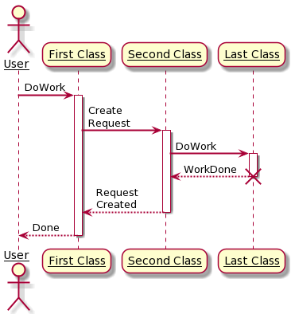
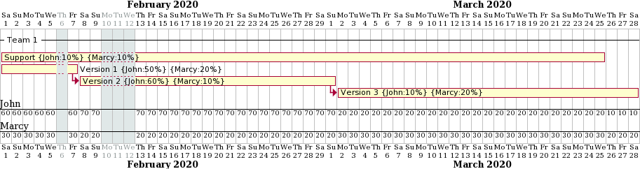
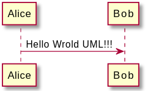
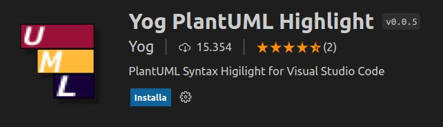
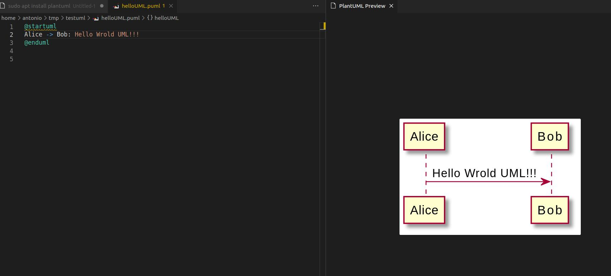
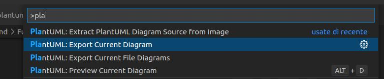

# UML 

TPSI4 HTML per sviluppatori

<div class="pt-12">
  <span class="px-2 py-1">
    Premi spazio o <carbon:arrow-right class="inline"/> per la prossima slide
  </span>
</div>


---
layout: section
---
<h1 class="sezione">plantUML diagram maker</h1>

--- #slide N

# plantUML

UML diagram maker

- [plantuml](https://plantuml.com/) è un software ed una libreria, scritta in Java, che permette di creare agevolmente i più importanti diagrammi UML:
  - Sequence diagram
  - Usecase diagram
  - Class diagram
  - Object diagram
  - Activity diagram
  - Component diagram
  - Deployment diagram
  - State diagram
  - Timing diagram


--- #slide N

# plantUML

UML diagram maker

<div grid="~ cols-2 gap-4">
<div>

- I diagrammi UML sono generati a partire da una descrizione testuale, tramite un linguaggio DSL (**D**omain **S**pecific **L**anguage) facile ed intuitivo.
- A prima vista può sembrare poco intuitivo, con con un pò di pratica si capiranno velocemente i benefici di tale strumento
- I diagrammi UML possono essere anche parecchio complessi, e l'editing con strumenti grafici può risultare lungo e tortuoso, specialmente l'aggiornamento di diagrammi esistenti

</div>
<div>



</div>
</div>

--- #slide N

# plantUML

UML diagram maker

- Ci sono vari strumenti che [usano ed integrano](https://plantuml.com/running) la libreria *plantUML*
- Il sito principale mette a disposizione un [editor online](http://www.plantuml.com/plantuml/) che permette di creare diagramma direttamente online
- Un altro strumento, basato su plantUML, molto valido è [plantext](https://www.planttext.com/). Questo online editor permette anche di creare moltissimi altri diagrammi non UML (es: gant)

<br />
<center>

</center>
 

--- #slide N

# plantUML

UML diagram maker

 - Tuttavia il modo migliore di usare plantUML è installarlo in locale sul proprio computer
- plantUML è uno strumento a linea di comando che prende in input un file testuale con la descrizione del diagramma e genera un'immagine del diagramma (default PNG file)

```bash
plantuml -v <input file>.puml
```
<div grid="~ cols-2 gap-4">
<div>

```bash
(0.000 - 250 Mo) 243 Mo - PlantUML Version 1.2018.13
(0.021 - 250 Mo) 243 Mo - GraphicsEnvironment.isHeadless() false
(0.021 - 250 Mo) 243 Mo - Forcing resource load on OpenJdk
(0.237 - 250 Mo) 238 Mo - Found 1 files
(0.238 - 250 Mo) 238 Mo - Working on /home/antonio/tmp/testuml/helloUML.puml
(0.268 - 250 Mo) 237 Mo - Setting current dir: /home/antonio/tmp/testuml
(0.281 - 250 Mo) 237 Mo - Creating AParentFolderRegular /home/antonio/tmp/testuml
(0.317 - 250 Mo) 237 Mo - Reading file: helloUML.puml
(1.555 - 358 Mo) 282 Mo - Creating file: /home/antonio/tmp/testuml/helloUML.png
(1.606 - 358 Mo) 279 Mo - Creating image 205x126
(1.680 - 358 Mo) 278 Mo - Ok for com.sun.imageio.plugins.png.PNGMetadata
(1.780 - 358 Mo) 277 Mo - File size : 4687
(1.782 - 358 Mo) 277 Mo - Number of image(s): 1

```

</div>
<div>
<center>

</center>
</div>
</div>

--- #slide N

# plantUML

UML diagram maker

 ### installazione

- L'installazione in Linux è molto semplice (su windows plantuml è presente su choco)
  

```bash
sudo apt install plantuml
```
- creare un file `helloUML.puml` es eseguire `plantuml helloUML.puml`

```bash
@startuml
Alice -> Bob: Hello Wrold UML!!!
@enduml

```
- Se tutto funziona correttamente viene generato il file `helloUML.png`

<br />
<center>

</center>


--- #slide N

# plantUML

UML diagram maker

- E' possibile integrare plantUML in VS Code, in modo da poter generare i diagrammi UML direttamente dall'editor

### installazione 

1. Installare un estensione VScode chiamata `PlantUML` 

<br />

<br />
2. Installare un estensione VScode chiamata `Yog PlantUML Highlight`
<br /><br />

--- #slide N

# plantUML

UML diagram maker

3. Creare un nuovo file in VScode chiamato `hello.puml`
4. Salvare e premere `ALT + D` per aprire il preview del diagramma UML
<br />
<center>

</center>

--- #slide N

# plantUML

UML diagram maker

- Premendo la sequenza `CTRL + SHIFT + P` si accede alla palette dei comandi di VSCode
- Qui sono presenti comandi aggiuntivi (esportazione file, ...)

<br />
<center>

</center>
<br />

- Quest'estensione è molto utile e rende la creazione di diagrammi UML veloce e flessibile, sopratuttto in fase di update dei diagrammi
- Inoltre plantUML può essere integrato in pipeline e script di automazione 

--- #slide 1

# HTML

*H*yper *T*ext *M*arkup *L*anguage (linguaggio di markup per ipertesti), comunemente noto con l'acronimo di **HTML**, è un **linguaggio di markup** per la creazione di una pagina web. 

--- #slide 2

# HTML

<div grid="~ cols-2 gap-4">
<div>

- HTML5 linguaggio evoluto per il markup o descrizione delle pagine HTML
- Definito e standardizzato dal W3C (WWW Consortium)
- Descrive la semantica ed il contenuto di una pagina Web
- Definisce una serie di tecnologie correlate
- Note come HTML Living Standard (è in continua evoluzione)

</div>

<div>


</div>
</div>

--- #slide 3

# HTML

<div grid="~ cols-2 gap-4">
<div>

Una **pagina Web** contiene:

- immagini
- audio
- file multimediali
- testo
- hotword

Le **hotword** sono parti della pagina legate a link.

I **link** sono collegamenti che portano ad altre pagine o altre risorse.
</div>
<div>


</div>
</div>


---
layout: section
---
<h1 class="sezione">Ambiente di Sviluppo</h1>


--- slide #89

# Esercizio html_12

&nbsp;

Si richiede di:
1. Verificare il funzionamento del form e della validazione dei campi
2. Analizzaere il codice del form e del server in JavaScript
3. Modificare il codice del server in modo che sia presente **anche** la validazione dell'età, in modo che siano accettati solo valori compresi tra 19 e 31
4. Modificare il form in modo che sia presente anche il campo `Cognome`
5. Fornire il link github alla directory con nome |cognome|_form_server


