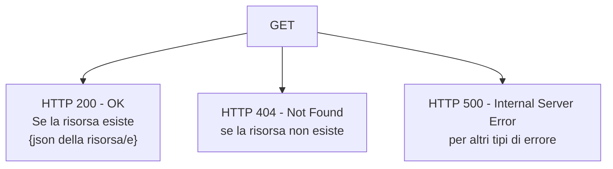
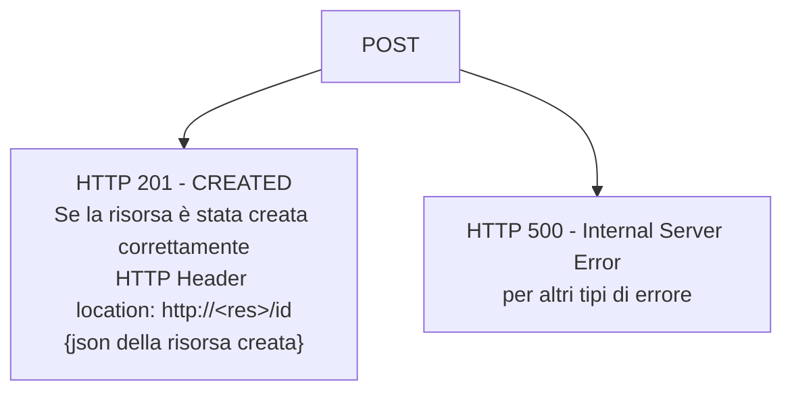
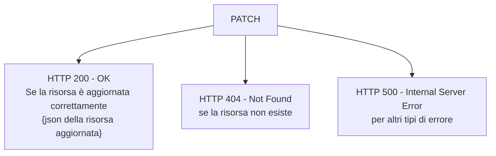
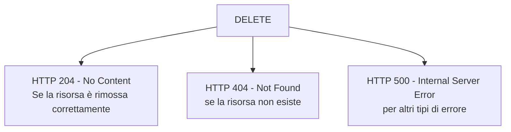

# ToDo List

REST API

- Una `ToDo list` è una lista di attività che devi o che vuoi svolgere
- In questa lezione vogliamo creare un RESTful API che implementa il servizio back-end per un'applicazione ToDo List
- In altre parole vogliamo sviluppare un API REST con SvelteKit che permetta di gestire la risorsa ToDo List


---

# ToDo List

REST API

- Iniziamo considerando che una ToDo List è una lista di ToDo e definendo due apsetti fondamentali:
  - come è strutturata la nostra risorsa ToDo (**il modello della risorsa**) ?
  - quali operazioni, relative alla risorsa, fornirà la nostra API ai suoi utenti ? 


---

# ToDo List

REST API

- Per creare il modello della nostra risorsa, possiamo utilizzare un linguaggio dichiarativo chiamato `JSON Schema` 
 --> maggiori informazioni su [JSON Schema](https://json-schema.org/)

<br>
<Banner padding="20px">
JSON Schema è un linguaggio dichiarativco che permette di definire la strutturazione e validazione di documenti in formato JSON
</Banner>
<br>

- JSON Schema è un semplice linguaggio che permette di definire in modo formale la struttura di un docuementi JSON
- JSON Schema fornisce delle librerie per validate un documento JSON nei confronti del relativo schema e dire è il documento è formato secondo lo schema oppure no


---

# ToDo List

REST API

- Qui il JSON schema dell'oggetto ToDo realizzato con [JSON Schema Editor](https://json-schema-editor.tangramjs.com/)


---

# ToDo List

REST API

- Per validare un oggetto JSON con lo schema appena definito possiamo usare per esempio [JSON Schema Linter](https://jsonschemalint.com/#!/version/draft-07/markup/json)


---

# ToDo List

Esercitazione_01

- Definire con JSON Schema Editor lo schema come nelle slide
- Fare delle prove di validazione con JSON Schema Linter
  
---

# ToDo List

REST API

- Per quanto riguarda le operazioni che è possibile eseguire sulla risorsa Todo List e  esposte dall'API:
  - `Crea` un nuovo ToDo ed aggiungilo alla lista attuale
  - `Ottieni` la lista di tutti i ToDo presenti nella lista
  - `Ottieni` un singolo ToDo identificato dal suo id
  - `Ottieni` tutti i todo che sono completi/incompleti
  - `Ottieni` tutti i todo data una certa priorità
  - `Cambia` il task di un ToDo identificato dal suo id
  - `Cambia` la priorità di un ToDo identificato dal suo id
  - `Cambia` lo stato di un ToDo identificato dal suo id
  - `Rimuovi` un ToDo dalla lista in base al suo id

- E' possibile immaginare altre operazioni, ma per il momento ci limitiamo a quanto descritto


---

# ToDo List


| #   | **Azione**                                            | **CRUD** | **HTTP**  |
| --- | ----------------------------------------------------- | :------: | :-------: |
| 1   | Crea un nuovo ToDo ed aggiungilo alla lista attuale   |    C     |   POST    |
| 2   | Ottieni la lista di tutti i ToDo presenti nella lista |    R     |    GET    |
| 3   | Ottieni un singolo ToDo identificato dal suo id       |    R     |    GET    |
| 4   | Ottieni tutti i todo che sono completi/incompleti     |    R     |    GET    |
| 5   | Ottieni tutti i todo che hanno una data priorità      |    R     |    GET    |
| 6   | Aggiorna un oggetto ToDo                              |    U     |    PUT    |
| 7   | Cambia il task di un ToDo identificato dal suo id     |    U     | PATCH     |
| 8   | Cambia la priorità di un ToDo identificato dal suo id |    U     | PATCH     |
| 9   | Cambia lo stato di un ToDo identificato dal suo id    |    U     | PATCH     |
| 10  | Rimuovi un ToDo dalla lista in base al suo id         |    D     |  DELETE   |


---

# ToDo List

SvelteKit end points

- Ora che abbiamo fatto il design della nostra RESTful API possiamo passare all'implementazione
- Quindi come analizzatro nella tabella precedente dovremo realizzare tutti i metodi necessario ad implementare le 10 azioni descritte
- Questi metodi dovranno rispondere al corrispondetnte verbo HTTP (questo è il principio base di REST)
- Finora abbiamo visto che lato back-end possiamo definire un *Default action* per gestire i form


---

# ToDo List

SvelteKit end points

- Quindi ciò significa che possiamo gestire solo il verbo POST di HTTP
- SvelteKit ci viene in aiuto con il suo flessibilissimo e potente sistema di routing
- Pertanto ci permette di definire facilmente degli `end points` per le nostre API REST
- Ogni end point gestire un'unica risorsa e implementa metodi che rispondono a richieste HTTP
- Quindi da questo si evince che gli end points di SvelteKit hanno tutte le caratteristiche per implementare un RESTfull API


---

# ToDo List

SvelteKit end points

- Come abbiamo visto un file *+page.server.js* è il back-end fi una pagina front-end *+page.svelte*
- Ma per la realizzazione di un API non ci sarà nessun front-end, quindi abbiamo bisogno di specificare un back-end NON associato a nessuna pagina front-end
- Questo si può fare facilmente tramitre la creazione di un file chiamato `+server.js`
- Pertanto nella directory *routes* creiamo la route per la nostra API in questo modo

```bash
routes
└── api
    └── todos
        └── +server.js --> implementa solo il back-end di una route
```


---

# ToDo List

Esercitazione_02

- Creare lo sketeton di un progetto SvelteKit chiamato **todo-api**
- Creare la route per la nostra API todo


---

# ToDo List

REST API

- L'end point definito dal file *+server+js* permette di esportare dei metodi che corrispondono a tutti i verbi HTTP (GET, POST, PUT, PATCH, DELETE, OPTIONS)
- Ogni metodo riceve in input un argomento di tipo `RequestEvent` e restituisce un oggetto di tipo `Response`


---

# ToDo List

REST API

- Iniziamo con il creare uno `stub` per il metodo `handler` di HTTP GET (`azione #2`)

<br>
<Banner padding="25px">
Uno STUB è una porzione di codice, un metodo, un modulo che sotituisce temporaneamente un metodo o modulo che non è ancora stato scritto e fornisce lo stesso output del modulo finale.
</Banner>
<br>

- Gli STUB vengono utilizzati durante i test di integrazione Top-down, al fine di simulare il comportamento dei moduli di livello inferiore che non sono ancora integrati. 
- E' uno strumento importantissimo durante lo sviluppo e testing del software
  


---

# ToDo List

REST API

*routes/api/todos/+server.js*


---

# ToDo List

Esercitazione_03

- Implementare l'handler per HTTP GET
- Modificare il file `vite.config.js`, al fine di fire il binding del server di sviluppo su 0.0.0.0 e non su 127.0.0.1
- Interrogare l'API con *Thunderclient*
- Verificare l'output sulla console del back-end
  


---

# ToDo List

REST API

- Ora vogliamo creare l'handler per `azione #3` che ci fornisce uno specifico oggetto todo in base al suo id
- In base al paradigma REST dobbiamo passare l'id dell'oggetto come parte del URL, cioè dobbiamo effettuare delle richieste con URL così formate

```bash
http://localhost:5173/todos/<id> #dove <id> è l'id della risorsa che vogliamo prelevare

http://localhost:5173/todos/18
http://localhost:5173/todos/32
http://localhost:5173/todos/28
```

- Tuttavia se proviamo otteniamo un errore


- Perchè?

---

# ToDo List

REST API

- Al momento ciò è corretto siccome abbiamo create una route in sveltekit specificatamente per URL del tipo */api/todos*
- Pertanto quando arriva una richiesta del tipo */api/todos/18* non è presente un handler e quindi viene generato l'errore
- Infatti anche nella console del back-end questo è evidente


---

# ToDo List

REST API

- Quindi per risolvere questo erorre, dobbiamo ricorrere nuovamente al potentissimo sistema di routing di SvelteKit
- Dobbiamo quindi creare un route con un parametro **opzionale**, appunto per gestire URL del tipo */api/todos* e */api/todos/&lt;id&gt;*  
- Per fare ciò abbiamo bisogno di modificare la route precedente nel modo seguente

<br>

```bash
routes
└── api
    └── todos
        ├── [[id]] --> definisce il parametro opzionale id; [id] il parametro diventa obbligatorio
            └── +server.js --> serve le URL /api/todos/ e /api/todos/<id>
```

<br>

- In questo modo potremo scrivere gli handler per tutti i metodi che passano l'id nell'URL (GET, PUT, PATCH, DELETE)
  
---

# ToDo List

REST API

- Pertanto procediamo modifichiamo l'handler per *azione#2* in modo da poter gestire anche *azione #3* editando il file *routes/api/todos/[[id]]/+server.js*


---

# ToDo List

Esercitazione_04

- Implementare l'handler per HTTP GET con parametro id
- Interrogare l'API con *Thunderclient*
- Verificare l'output sulla console del back-end


---

# ToDo List

REST API

- A questo punto abbiamo creato il routing per la nostra REST API in modo corretto ed abbiamo anche implementato lo stub per il metodo GET e le azioni #2 e #3
- Ora implementiamo `azione#1` implementando lo stub per il metodo POST


---

# ToDo List

REST API


<br>

- Nel body fornisco l'oggetto ToDo in formato JSON che voglio creare ed aggiungere alla ToDo List


---

# ToDo List

Esercitazione_05

- Implementare lo stub del metodo POST 
- Verificarne il corretto funzionamento aggiungendo due nuovi ToDo


---

# ToDo List

REST API

- Ora implementiamo `azione#6` scrivendo l'handler per il metodo PUT
- L'handler aggiorna l'oggetto passato nel body per id specificato nell'URL
  


---

# ToDo List

Esercitazione_06

- Implementare lo stub del metodo PUT 
- Verificarne il corretto funzionamento aggiungendo modificando un ToDo e verificando l'effettivo aggiornamento


---

# ToDo List

REST API

- Ora implementiamo `azione#7, azione#8 e azione#9` scrivendo l'handler per il metodo PATCH
- L'handler aggiorna solo la chiave passata nell'oggetto nel body in funzione dell'id specificato nell'URL


---

# ToDo List

Esercitazione_07

- Implementare lo stub del metodo PATCH 
- Verificarne il corretto funzionamento aggiungendo modificando i vari campi di un ToDo e verificando l'effettivo aggiornamento del solo campo specificato nel body di HTTP PATCH


---

# ToDo List

REST API

- Ora implementiamo `azione#10` scrivendo l'handler per il metodo HTTP DELETE
- L'handler rimuove il ToDo dalla ToDo List in funzione dell'id passato nell'URL
  


---

# ToDo List

Esercitazione_08

- Implementare lo stub del metodo DELETE 
- Verificarne il corretto funzionamento rimuovendo un ToDo presente nella lista e verificando l'effettiva eliminazione


---

# ToDo List

REST API

- A questo punto abbiamo implementato tutte le funzioni CRUD e la nostra API inizia a funzionare correttamente
- Vediamo ora come implementare `azione#4  e azione#5`
- Per implementare queste funzionalità abbiamo la necessità di fornire informazioni aggiuntive alla GET
- Mentre l'id viene passato direttamente come parte dell'URL, per fornire informazioni aggiuntive è necessario ricorrere al meccanismo del [query string](https://it.wikipedia.org/wiki/Query_string)
- Una query-string è la parte di un URL che contiene dei dati da passare in input ad un programma. I parametri sono separati dalla URL tramite il carattere `?`
- I parametri sono nel formato `key = value` e separati dal carattere `&`

---

# ToDo List

REST API


---

# ToDo List

REST API

- Modifichiamo il GET handler <br> nel seguente modo


---

# ToDo List

Esercitazione_09

- Implementare le modifiche dello stub GET per supportare il query string 
- Verificarne il corretto funzionamento filtrando la lista di ToDo per priority e per stato


---

# ToDo List

Esercitazione_10

- Consegnare su GitHub tutto il lavoro svolto fino ad ora
- Fare il push sul proprio fork del mio repository
- Assolutamente non fare il commit della directory *node_modules*

---

# ToDo List

REST API

- Bene abbiamo implementato tutti gli stub del back-end per implementare le funzionalità delle 10 azioni definite durante la fase di progettazione dell'API
- Questa metodologia nell'uso degli stub ci ha permesso di creare il codice back-end focallizzandoci inizialmente sull'implementazione dell'API senza aggiungere complessità non necessaria in questa fase
- Infatti tutte le operazioni CRUD, testate con thunderclient, sono funzionanti
- Questi ci ha permesso di non dispendere energie lavorando sull'integrazione del DB e su altri aspetti importanti per rendere la API completa
- Pertanto in questa seconda fase del progetto, forti del fatto che l'API funziona correttamente, ci focalizzeremo sulla parte di DB e su gli aspetti mancanti per passare dagli stub al codice finale


---

# ToDo List

REST API

- Siccome vogliamo utilizzare un DB relazionale, il primo passo consiste nello sviluppare il diagramma E-R (banale in quanto abbiamo una sola entità e nessuna relzione)
- Successivamente dobbiamo passare alla creazione del DB utilizzando il linguaggio SQL DDL


---

# ToDo List

REST API

<div style="width:50%;">

- Useremo l'eccellente DB [SQLite](https://www.sqlite.org/index.html) e per interagire con esso utilizeremo un tool chiamato [sqlitebrowser](https://sqlitebrowser.org/)
- L'installazione è semplicissima

```bash
# sudo apt install sqlitebrowser
```

</div>


---

# ToDo List

REST API

- Iniziamo creando il DB `TODO.db` nella root del nostro progetto *todo-api*


---

# ToDo List

REST API

<div style="width:40%;">

- Creiamo l'unica tabella `todo` del nostro DB
- Siccome non è presente il tipo Boolean utilizziamo 0 -> false e 1 -> true per il campo *done*

</div>


---

# ToDo List

REST API

- Ora creiamo un qualche ToDo per poter iniziare a testare la nostra API


---

# ToDo List

REST API

- Come abbiamo visto nell'introduzione sulle REST API le varie chiamate devono restituire al client dei precisi codici HTTP
- Questo perchè il client ha bisogno di sapere se la chiamata è andata a buon fine o se ci sono stati degli errori
- Nella nostra prima implementazione degli stub, abbiamo intenzionalmente tralasciato questo aspetto, per ridurre la complessità
- Ora tuttavia è necessario introdurre la gestione degli stati HTTP per rendere al nostra REST API corretta e completamente funzionante
- Di seguito vediamo quali sono i possibili stati HTTP per ogni tipo di chiamata

---

# ToDo List

REST API

***GET**: richiede una risosra esistente*

<br><br>
<center>

</center>

---

# ToDo List

REST API

***POST**: Crea una nuova risorsa*

<br><br>
<center>

</center>

---

# ToDo List

REST API

***PUT**: aggiorna una completamente risosra esistente*

<br><br>
<center>

</center>

---

# ToDo List

REST API

***PATCH**: aggiorna una parzialmente risosra esistente*

<br><br>
<center>

</center>

---

# ToDo List

REST API

***DELETE**: rimuove una risosra esistente*

<br><br>
<center>

</center>

---

# ToDo List

REST API

- Iniziamo con il commentare tutti i metodi per evitare possibili errori
- Adesso trasformiamo lo stub per le `azioni #2 #3 #4 e #5` nel codice finale con il supporto al DB e la gestione corretta dei codici di ritorno HTTP in base a quanto visto prima


---

# ToDo List

REST API

- Iniziamo a progettare le query per le varie azioni e le testiamo con *sqlitebrowser*

**azione #2**
Ottieni la lista di tutti i ToDo presenti nella lista

```sql
SELECT * FROM todo;
```


---

# ToDo List

REST API

**azione #3**
Ottieni un singolo ToDo identificato dal suo id

```sql
SELECT * FROM todo WHERE id=2;
```


---

# ToDo List

REST API

**azione #4**
Ottieni tutti i todo che sono completi/incompleti

```sql
SELECT * FROM todo WHERE done = 0;
```


---

# ToDo List

REST API

**azione #5**
Ottieni tutti i todo che hanno una data priorità

```sql
SELECT * FROM todo WHERE priority = 2;
```


---

# ToDo List

REST API

<div style="width:40%;">

- Ora passiamo all'implementazione aggiornando il file *src/routes/api/todos/[[id]]/+server.js*

</div>


---

# ToDo List

Esercitazione_11

- Implementare il codice per le *azioni #2, #3, #4, #5*
- Testare il corretto funzionamento di tutte e 4 le azioni con *thunderclient*
- Consegnare su github facendo il push sul proprio fork del mio repository
- Consegnare il codice e 8 screenshot per ogni test eseguito
  - 1 x azione 2
  - 2 x azione 3 (caso positivo e negativo)
  - 2 x azione 4 (caso positivo e negativo)
  - 3 x azione 5 (caso positivo e negativo)
- Assolutamente non fare il commit della directory *node_modules*

---

# ToDo List

REST API

- xxxx


---

# ToDo List

REST API

- xxxx


---

# ToDo List

REST API

- xxxx


---

# ToDo List

REST API

- xxxx


